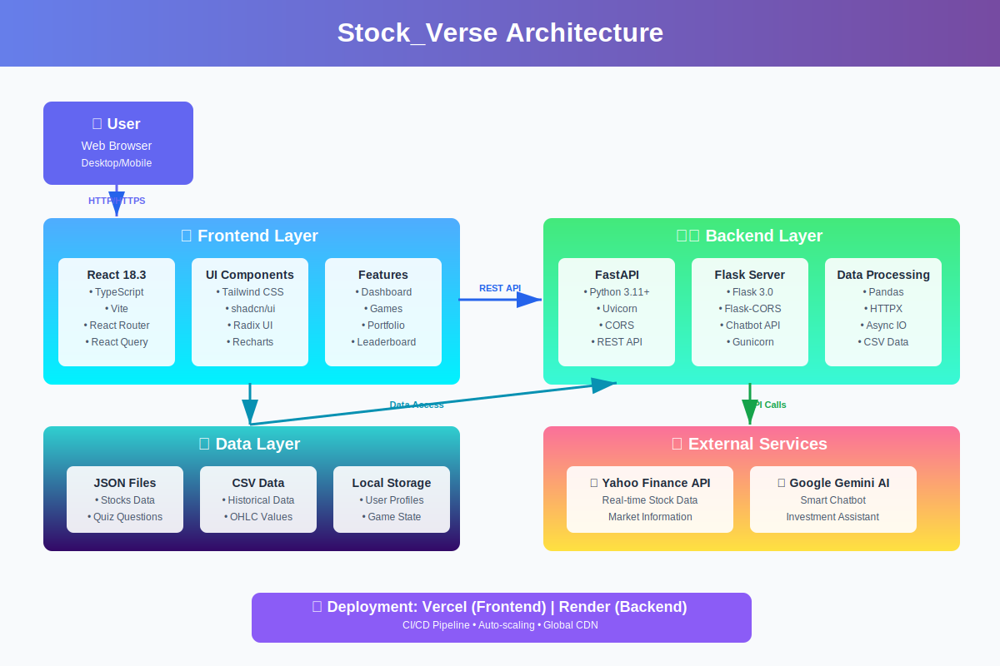

# Stock_Verse

<div align="center">


</div>

A modern financial learning platform that gamifies stock market education for young investors, combining real-time market data with interactive games and smart assistance.

## 🏗️ Architecture

<div align="center">
  
</div>

The application follows a modern full-stack architecture with:
- **Frontend**: React 18 with TypeScript, styled using Tailwind CSS and shadcn/ui components
- **Backend**: Python services using FastAPI and Flask for different microservices
- **External APIs**: Integration with Yahoo Finance for real-time stock data and Google Gemini AI for intelligent chatbot assistance
- **Data Layer**: JSON and CSV files for static data, browser local storage for user state
- **Deployment**: Frontend on Vercel, Backend on Render with CI/CD pipelines

## Features

- Interactive Financial Dashboard
- Live Market Graphs
- Smart Investment Assistant
- Stock Market Games
- Financial Education Quizzes
- Leaderboard System
- Portfolio Management
- News Integration

## 🛠️ Technologies Used

### Frontend Stack
- **React 18.3.1** - Modern UI library with hooks and concurrent features
- **TypeScript 5.8.3** - Type-safe JavaScript development
- **Vite 5.4.19** - Lightning-fast build tool and dev server
- **Tailwind CSS 3.4.17** - Utility-first CSS framework
- **shadcn/ui** - High-quality React component library built on Radix UI
- **Radix UI** - Unstyled, accessible component primitives
- **Recharts 2.15.4** - Composable charting library for data visualization
- **React Router 6.30.1** - Declarative routing for React
- **TanStack Query 5.83.0** - Powerful asynchronous state management
- **Lucide React** - Beautiful & consistent icon toolkit

### Backend Stack
- **Python 3.11+** - Modern Python with enhanced performance
- **FastAPI 0.104.1** - High-performance async API framework
- **Flask 3.0.0** - Lightweight WSGI web application framework
- **Uvicorn** - Lightning-fast ASGI server
- **Gunicorn 21.2.0** - Production-grade WSGI HTTP server
- **Pandas 2.1.4** - Powerful data analysis and manipulation
- **HTTPX 0.25.0** - Modern HTTP client for Python
- **Flask-CORS 4.0.0** - Cross-Origin Resource Sharing support

### External Integrations
- **Yahoo Finance API** - Real-time stock market data
- **Google Gemini AI** - Advanced AI-powered chatbot assistant

### Development & Deployment
- **ESLint** - Code quality and consistency
- **PostCSS & Autoprefixer** - CSS processing and vendor prefixing
- **Vercel** - Frontend hosting with global CDN
- **Render** - Backend service hosting

## 🚀 Getting Started

### Prerequisites
- Node.js v16 or higher
- Python 3.11 or higher
- npm or bun package manager
- pip (Python package installer)

### 📦 Frontend Setup
```bash
# Install dependencies
npm install

# Start development server (runs on port 8080)
npm run dev

# Build for production
npm run build

# Preview production build
npm run preview
```

### 🐍 Backend Setup
```bash
# Navigate to backend directory
cd backend

# Install Python dependencies
python install_dependencies.py

# Start all servers (FastAPI + Flask)
python start_all_servers.py

# Or start servers individually:
# - FastAPI server (stock data)
python start_server.py

# - Flask server (chatbot)
python chatbot_server.py
```

### 🌐 Environment Variables
Create a `.env` file in the backend directory:
```env
VITE_API_URL=http://localhost:8000
VITE_ASSISTANT_URL=http://localhost:5000
GEMINI_API_KEY=your_gemini_api_key_here
```

## 📁 Project Structure
```
Stock_Verse/
├── src/                          # Frontend source code
│   ├── components/               # React components
│   │   ├── ui/                  # shadcn/ui components
│   │   ├── StockCard.tsx        # Stock display components
│   │   ├── StockChart.tsx       # Chart visualizations
│   │   ├── FinancialGameModal.tsx
│   │   ├── PortfolioManager.tsx
│   │   ├── StockBot.tsx         # AI Chatbot interface
│   │   └── ...                  # Other components
│   ├── pages/                   # Application pages
│   │   ├── Index.tsx            # Main dashboard
│   │   └── NotFound.tsx         # 404 page
│   ├── services/                # API service layer
│   │   └── marketData.ts        # Market data services
│   ├── hooks/                   # Custom React hooks
│   ├── data/                    # Static JSON data files
│   │   ├── stocks.json          # Stock information
│   │   ├── student_events.json  # Game events
│   │   └── ...                  # Quiz questions
│   ├── lib/                     # Utility functions
│   └── assets/                  # Static assets
│
├── backend/                      # Python backend services
│   ├── server.py                # FastAPI server (stock data API)
│   ├── chatbot_server.py        # Flask server (AI chatbot)
│   ├── data.csv                 # Historical stock data (OHLC)
│   ├── requirements.txt         # Python dependencies
│   ├── start_all_servers.py    # Multi-server launcher
│   ├── install_dependencies.py  # Dependency installer
│   └── templates/               # Flask HTML templates
│
├── public/                       # Static public assets
├── architecture.svg              # Architecture diagram
├── package.json                  # Node.js dependencies
├── vite.config.ts               # Vite configuration
├── tailwind.config.ts           # Tailwind CSS configuration
├── tsconfig.json                # TypeScript configuration
├── vercel.json                  # Vercel deployment config
└── README.md                    # This file
```

## 🎮 Key Features Explained

### Interactive Dashboard
- Real-time stock price updates from Yahoo Finance API
- Multiple theme support (Default, Doraemon, Pikachu, Shinchan)
- Live candlestick charts and trend graphs
- News ticker with latest financial updates

### Educational Games
- **Stock Market Simulator**: Practice trading with virtual money
- **Ten Year Bet Game**: Predict long-term stock performance
- **Financial Quiz**: Test your knowledge with interactive questions
- **News Flash Events**: Random market events to challenge decision-making

### Smart Assistant
- AI-powered chatbot using Google Gemini
- Context-aware investment advice
- Real-time stock data integration
- Natural language query understanding

### Portfolio Management
- Track virtual investments
- Performance analytics
- Profit/Loss calculations
- Transaction history

### Gamification Elements
- XP and leveling system
- Global leaderboard
- Achievement badges
- Student and adult quiz modes

## 🔒 API Endpoints

### FastAPI Server (Port 8000)
- `GET /next_data` - Fetch next OHLC data point
- `GET /health` - Health check endpoint

### Flask Server (Port 5001)
- `POST /api/chat` - Chatbot message endpoint
- `GET /api/stock-data` - Current stock data
- `GET /` - Chatbot interface

## 🤝 Contributing

Contributions are welcome! Please feel free to submit a Pull Request. For major changes, please open an issue first to discuss what you would like to change.

### Contribution Guidelines
1. Fork the repository
2. Create your feature branch (`git checkout -b feature/AmazingFeature`)
3. Commit your changes (`git commit -m 'Add some AmazingFeature'`)
4. Push to the branch (`git push origin feature/AmazingFeature`)
5. Open a Pull Request


<div align="center">

</div>
